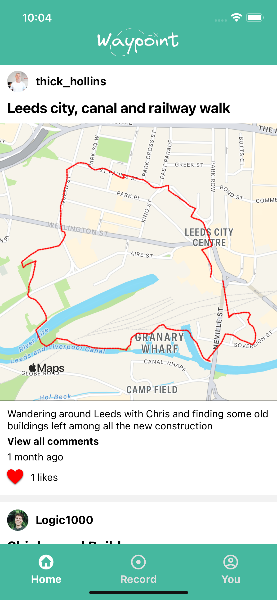
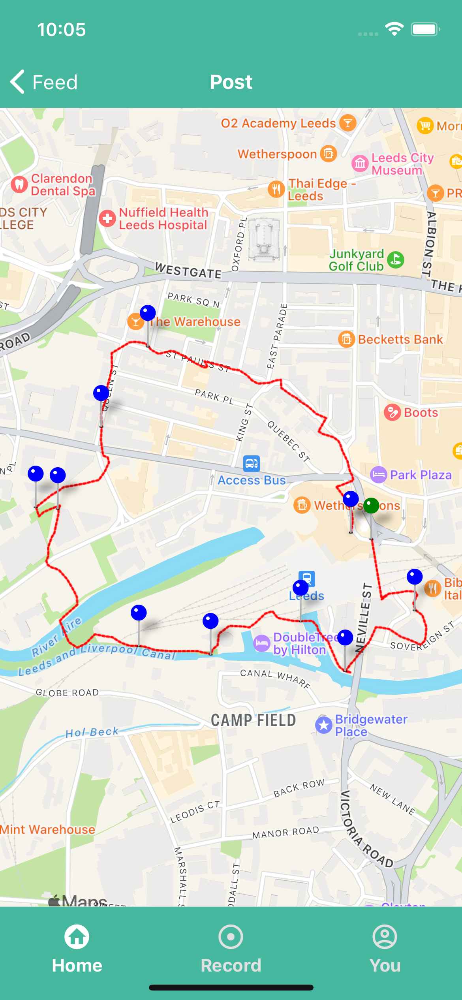
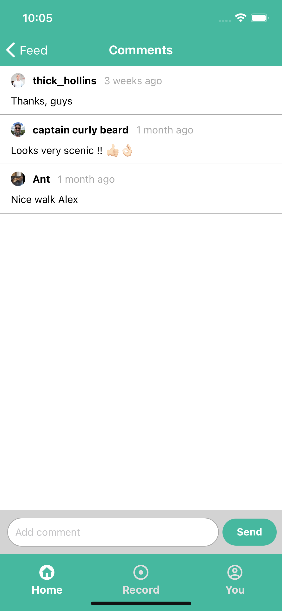

# Waypoint
A social, virtual sightseeing mobile app, where users log there adventures and attach photos and comments to specific points of interest for other users to interact with. Back-end built in Node.js, using Express and MongoDB, with AWS S3 for photo storage. Front-end built with React Native and Expo.

- Hosted API [_here_](https://waypoint-server.herokuapp.com/api).
- Published app [_here_](https://expo.dev/@cjpearson/waypoint).
- Back-end repo [_here_](https://github.com/cjpearson85/waypoint-be).
- Front-end repo [_here_](https://github.com/cjpearson85/waypoint-fe).
- Watch our presentation [_here_](https://youtu.be/rmPnrpoBBiA).


## Table of Contents
* [Requirements](#requirements)
* [Features](#features)
* [Screenshots](#screenshots)
* [Local Installation](#local-installation)
* [Usage](#usage)
* [Project Status](#project-status)
* [Room for Improvement](#room-for-improvement)
* [Acknowledgements](#acknowledgements)
* [Contact](#contact)


## Requirements
- Node v16.0.0
- Expo Go - to run on your mobile device


## Features
- A social media-style feed where users can scroll through recent activity.
- Users can like and comment on other users posts.
- Users can see another users profile and view their recent activity.
- Users can view a more detailed version of individual routes, click on any waypoints the creator may have placed and view any attached photos or captions.
- Users can upload their own posts. Location tracking will log their route and users can optionally attach photos and comments to particular places of interest, that will appear as waypoints along their plotted route.


## Screenshots





## Local Installation
To run this project, install it locally using npm:

```
$ git clone https://github.com/cjpearson85/waypoint-fe.git
$ cd waypoint-fe
$ expo install
$ expo start
```

## Usage
Once the dependencies are installed, you can run 'expo start' to start the application. Download the Expo Go app and scan the QR code to view the app on your mobile device, or run locally on iOS simulator or Android simulator.


## Project Status
Project is: _no longer being worked on_. No further work has been done on this project since the final presentation.


## Room for Improvement
Room for improvement:
- Background location tracking only works on Android.
- Following and followers not currently implemented.
- Likes don't update server-side presently.
- Feed would filter by who the user is following ideally.
- Allow users to update personal details, not implemented client-side.
- Allow users to edit their posts after upload.


## Acknowledgements
Built with help from:
- [@AnthonyMcGreal](https://github.com/AnthonyMcGreal)
- [@thick-hollins](https://github.com/thick-hollins)
- [@mr-joelM](https://github.com/mr-joelM)
- [@Mattk47](https://github.com/Mattk47)


## Contact
Created by [@cjpearson85](https://cjpearson-dev.netlify.app/) - feel free to contact me!
